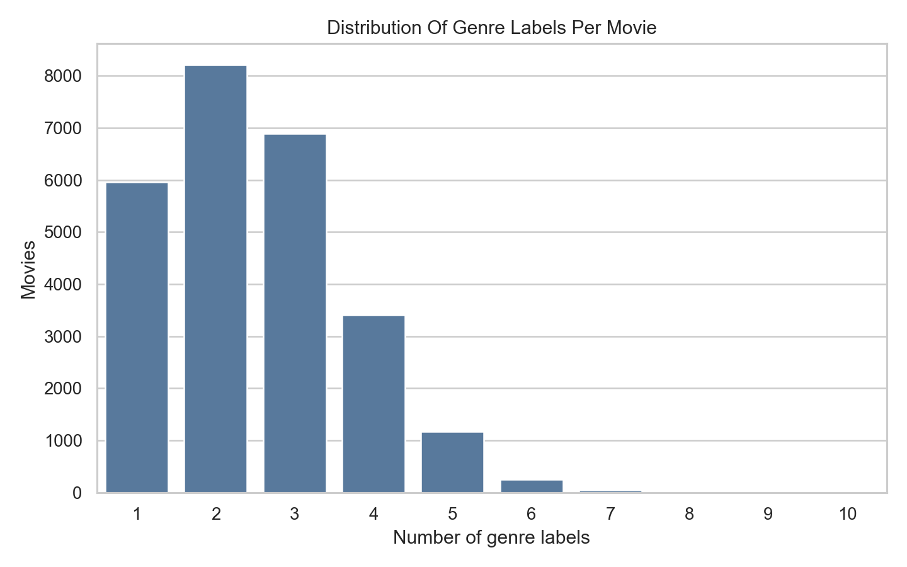
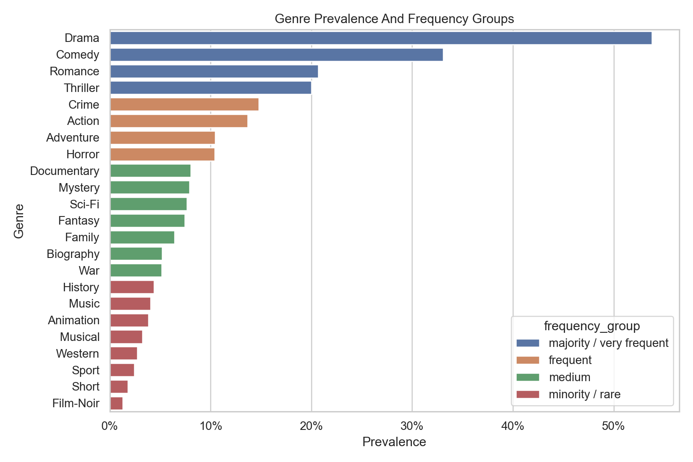
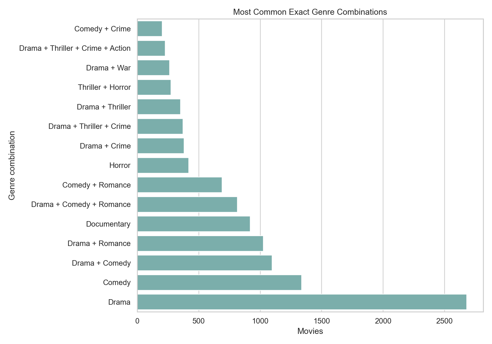
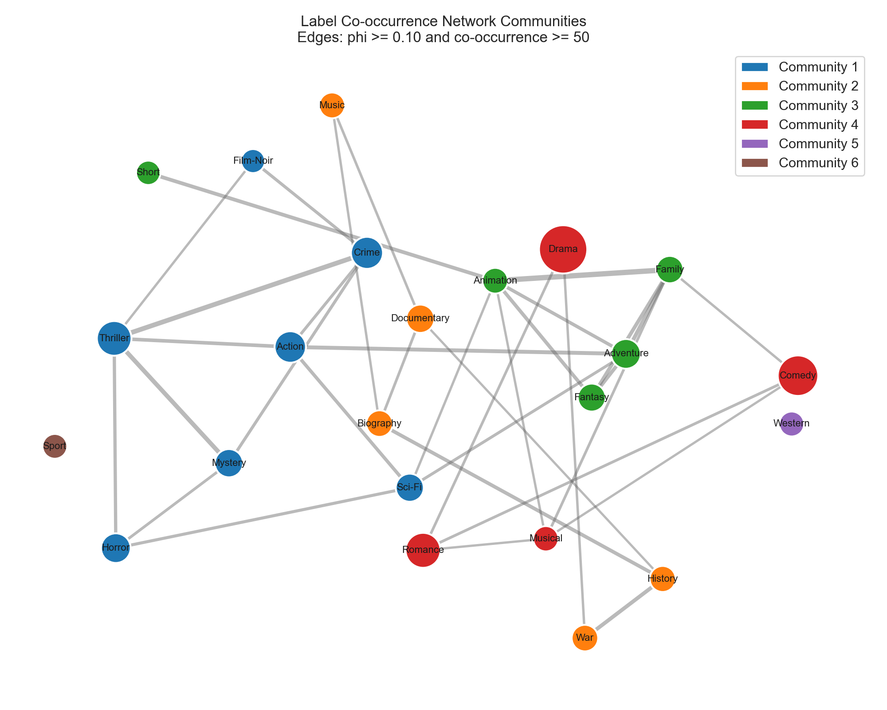
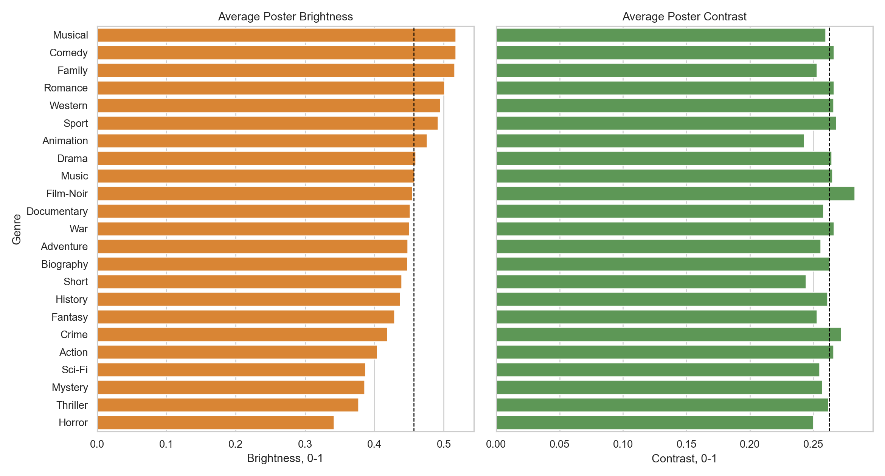
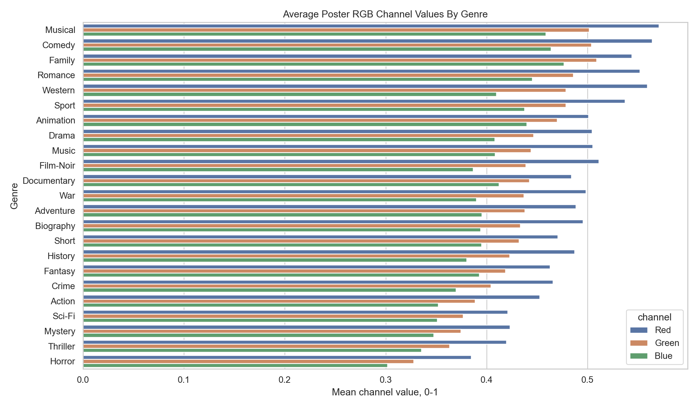
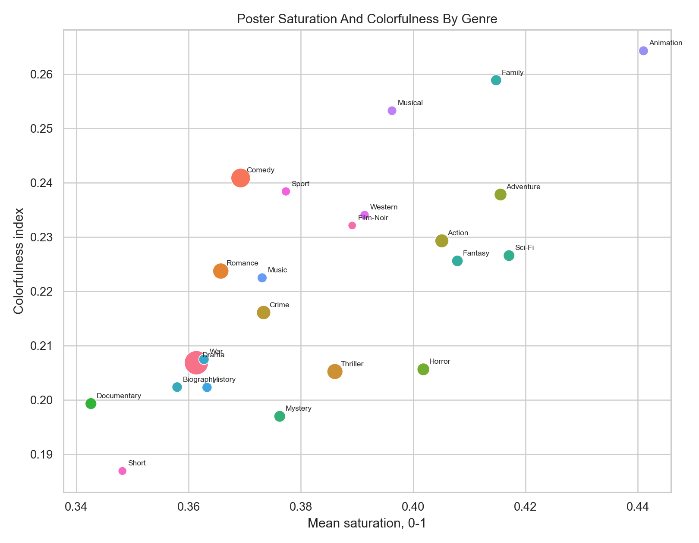

# Additional MM-IMDb Dataset Discovery Report

## Purpose

This report adds deeper dataset discovery for the MM-IMDb multilabel genre dataset. It focuses on label cardinality, label frequency groups, exact genre combinations, genre communities, frequent words by genre, and poster-level visual statistics.

The analysis uses all `25,959` movies and all `23` genre labels.

## 1. Label Cardinality And Density

Label cardinality is the average number of active labels per movie.

- Label cardinality: `2.485` labels per movie
- Label density: `0.108`
- Interpreted as percentage of all possible labels: `10.80%`

The average movie has about `2.48` genre labels out of `23` possible labels.

| Labels per movie | Movies | Percent |
| --- | --- | --- |
| 1.000 | 5965.000 | 22.98% |
| 2.000 | 8211.000 | 31.63% |
| 3.000 | 6894.000 | 26.56% |
| 4.000 | 3404.000 | 13.11% |
| 5.000 | 1172.000 | 4.51% |
| 6.000 | 255.000 | 0.98% |
| 7.000 | 47.000 | 0.18% |
| 8.000 | 6.000 | 0.02% |
| 9.000 | 3.000 | 0.01% |
| 10.000 | 2.000 | 0.01% |

## 2. Minority And Majority Label Groups

Labels are grouped by prevalence:

- majority / very frequent: at least 20% of movies
- frequent: 10% to 20% of movies
- medium: 5% to 10% of movies
- minority / rare: below 5% of movies

| Genre | Count | Prevalence | Group | Imbalance vs Drama |
| --- | --- | --- | --- | --- |
| Drama | 13967 | 53.80% | majority / very frequent | 1.00x |
| Comedy | 8592 | 33.10% | majority / very frequent | 1.63x |
| Romance | 5364 | 20.66% | majority / very frequent | 2.60x |
| Thriller | 5192 | 20.00% | majority / very frequent | 2.69x |
| Crime | 3838 | 14.78% | frequent | 3.64x |
| Action | 3550 | 13.68% | frequent | 3.93x |
| Adventure | 2710 | 10.44% | frequent | 5.15x |
| Horror | 2703 | 10.41% | frequent | 5.17x |
| Documentary | 2082 | 8.02% | medium | 6.71x |
| Mystery | 2057 | 7.92% | medium | 6.79x |
| Sci-Fi | 1991 | 7.67% | medium | 7.02x |
| Fantasy | 1933 | 7.45% | medium | 7.23x |
| Family | 1668 | 6.43% | medium | 8.37x |
| Biography | 1343 | 5.17% | medium | 10.40x |
| War | 1335 | 5.14% | medium | 10.46x |
| History | 1143 | 4.40% | minority / rare | 12.22x |
| Music | 1045 | 4.03% | minority / rare | 13.37x |
| Animation | 997 | 3.84% | minority / rare | 14.01x |
| Musical | 841 | 3.24% | minority / rare | 16.61x |
| Western | 705 | 2.72% | minority / rare | 19.81x |
| Sport | 634 | 2.44% | minority / rare | 22.03x |
| Short | 471 | 1.81% | minority / rare | 29.65x |
| Film-Noir | 338 | 1.30% | minority / rare | 41.32x |

The imbalance ratio compares each genre to `Drama`, the most common label. For example, `Film-Noir` is about `41.32x` smaller than `Drama`.

## 3. Most Common Exact Genre Combinations

An exact genre combination means the complete label set assigned to a movie. For example, a movie labeled only `Drama` is a different combination from `Drama + Romance`.

Total unique exact genre combinations: `2,218`

| Combination | Labels | Movies | Percent |
| --- | --- | --- | --- |
| Drama | 1 | 2681 | 10.33% |
| Comedy | 1 | 1337 | 5.15% |
| Drama + Comedy | 2 | 1097 | 4.23% |
| Drama + Romance | 2 | 1026 | 3.95% |
| Documentary | 1 | 918 | 3.54% |
| Drama + Comedy + Romance | 3 | 814 | 3.14% |
| Comedy + Romance | 2 | 690 | 2.66% |
| Horror | 1 | 417 | 1.61% |
| Drama + Crime | 2 | 381 | 1.47% |
| Drama + Thriller + Crime | 3 | 371 | 1.43% |
| Drama + Thriller | 2 | 351 | 1.35% |
| Thriller + Horror | 2 | 273 | 1.05% |
| Drama + War | 2 | 261 | 1.01% |
| Drama + Thriller + Crime + Action | 4 | 226 | 0.87% |
| Comedy + Crime | 2 | 201 | 0.77% |
| Drama + Biography | 2 | 198 | 0.76% |
| Thriller + Crime + Action | 3 | 180 | 0.69% |
| Drama + Thriller + Crime + Mystery | 4 | 174 | 0.67% |
| Western | 1 | 173 | 0.67% |
| Thriller + Horror + Mystery | 3 | 160 | 0.62% |

Single-label `Drama` is the most common exact combination, but many top combinations contain two or three labels. This confirms that the task is meaningfully multilabel, not just a single-label classification problem with occasional extra tags.

## 4. Rare Exact Genre Combinations

Rare combinations are exact label sets that appear only once or very few times. They are important because they can be difficult for models to learn.

Number of exact combinations appearing once: `1,104`

Sample of exact combinations appearing once:

| Combination | Labels | Movies | Percent |
| --- | --- | --- | --- |
| History | 1 | 1 | 0.0039% |
| Sport | 1 | 1 | 0.0039% |
| Action + Family | 2 | 1 | 0.0039% |
| Adventure + Biography | 2 | 1 | 0.0039% |
| Adventure + Musical | 2 | 1 | 0.0039% |
| Adventure + Sport | 2 | 1 | 0.0039% |
| Biography + Sport | 2 | 1 | 0.0039% |
| Crime + Film-Noir | 2 | 1 | 0.0039% |
| Crime + History | 2 | 1 | 0.0039% |
| Crime + Musical | 2 | 1 | 0.0039% |
| Documentary + Fantasy | 2 | 1 | 0.0039% |
| Family + Music | 2 | 1 | 0.0039% |
| Fantasy + Music | 2 | 1 | 0.0039% |
| Fantasy + Musical | 2 | 1 | 0.0039% |
| Fantasy + Western | 2 | 1 | 0.0039% |
| History + Animation | 2 | 1 | 0.0039% |
| History + Musical | 2 | 1 | 0.0039% |
| Mystery + Fantasy | 2 | 1 | 0.0039% |
| Romance + History | 2 | 1 | 0.0039% |
| Sport + Film-Noir | 2 | 1 | 0.0039% |
| War + Short | 2 | 1 | 0.0039% |
| Western + Short | 2 | 1 | 0.0039% |
| Action + Adventure + Documentary | 3 | 1 | 0.0039% |
| Action + Adventure + Short | 3 | 1 | 0.0039% |
| Action + Family + Sport | 3 | 1 | 0.0039% |

Rare exact combinations are expected in multilabel genre data because the number of possible label sets is very large. This is one reason the project predicts each genre label rather than treating every combination as a separate class.

## 5. Co-occurrence Network And Communities

A label co-occurrence network was built using phi correlation as the edge weight. Edges were included only when:

- phi correlation is at least `0.10`
- co-occurrence count is at least `50`

This keeps the graph focused on stable positive relationships.

| Community | Genres | Genre count | Total label assignments |
| --- | --- | --- | --- |
| 1 | Thriller, Crime, Action, Horror, Mystery, Sci-Fi, Film-Noir | 7 | 19669 |
| 2 | Documentary, Biography, War, History, Music | 5 | 6948 |
| 3 | Adventure, Fantasy, Family, Animation, Short | 5 | 7779 |
| 4 | Drama, Comedy, Romance, Musical | 4 | 28764 |
| 5 | Western | 1 | 705 |
| 6 | Sport | 1 | 634 |

The communities show genre clusters that match intuitive movie categories, such as action/adventure/fantasy/family/animation relationships and thriller/crime/mystery relationships.

Top network edges by phi correlation:

| Genre A | Genre B | Phi | Co-occurrence |
| --- | --- | --- | --- |
| Family | Animation | 0.413 | 569 |
| Thriller | Crime | 0.355 | 2075 |
| Thriller | Mystery | 0.314 | 1293 |
| Adventure | Family | 0.271 | 701 |
| Action | Adventure | 0.270 | 1106 |
| War | History | 0.262 | 367 |
| Animation | Short | 0.251 | 185 |
| Fantasy | Family | 0.246 | 536 |
| Adventure | Fantasy | 0.242 | 707 |
| Biography | History | 0.238 | 340 |
| Thriller | Action | 0.238 | 1559 |
| Fantasy | Animation | 0.233 | 380 |
| Adventure | Animation | 0.217 | 435 |
| Action | Sci-Fi | 0.215 | 782 |
| Thriller | Horror | 0.207 | 1196 |

## 6. Most Frequent Words Per Genre

The following table shows the most frequent cleaned plot tokens for each genre. Common English stop words and very generic project-level words were removed.

| Genre | Top frequent words |
| --- | --- |
| Drama | love, family, father, old, time, wife, years, mother, world, lives |
| Comedy | love, family, time, father, old, friends, friend, wife, wants, school |
| Romance | love, father, family, time, meets, wife, old, years, friend, mother |
| Thriller | police, wife, family, time, house, years, soon, old, help, friend |
| Crime | police, murder, money, wife, time, family, old, years, help, friend |
| Action | world, time, help, police, war, years, men, father, way, old |
| Adventure | world, time, father, help, way, love, king, old, years, family |
| Horror | house, family, soon, night, old, years, people, home, death, group |
| Documentary | documentary, world, years, people, time, american, war, interviews, family, history |
| Mystery | police, murder, wife, house, death, years, old, soon, killer, case |
| Sci-Fi | earth, world, time, planet, people, years, soon, human, alien, help |
| Fantasy | world, time, love, evil, old, father, help, family, years, king |
| Family | family, father, world, old, home, time, friends, help, mother, love |
| Biography | world, years, family, time, war, love, father, true, death, old |
| War | war, world, german, army, men, american, british, soldiers, love, family |
| History | war, world, love, years, king, time, army, family, people, men |
| Music | music, band, rock, love, singer, time, world, years, family, school |
| Animation | world, time, way, help, home, friends, named, old, earth, save |
| Musical | love, father, family, girl, time, wants, musical, world, make, way |
| Western | town, john, men, gang, gold, war, west, old, father, way |
| Sport | team, world, game, coach, football, school, time, father, years, family |
| Short | charlie, home, time, way, world, old, night, house, room, girl |
| Film-Noir | police, wife, murder, money, night, joe, love, johnny, friend, meets |

These words are descriptive rather than causal. Frequent words can reveal genre themes, but they can also reflect common plot-summary language. A stronger future analysis would use TF-IDF or log-odds terms per genre to find words that are distinctive, not only frequent.

The full table is saved at:

- `outputs/dataset_discovery/most_frequent_words_per_genre.csv`

## 7. Poster Brightness And Contrast By Genre

Poster images were restored from their stored Caffe/VGG-style representation and summarized per genre.

Brightness is the average grayscale intensity. Contrast is the grayscale standard deviation. Both are scaled from 0 to 1.

| Genre | Brightness | Contrast | Saturation | Colorfulness | Dominant channel |
| --- | --- | --- | --- | --- | --- |
| Musical | 0.517 | 0.260 | 0.396 | 0.253 | red |
| Comedy | 0.517 | 0.266 | 0.369 | 0.241 | red |
| Family | 0.516 | 0.253 | 0.415 | 0.259 | red |
| Romance | 0.501 | 0.266 | 0.366 | 0.224 | red |
| Western | 0.495 | 0.266 | 0.391 | 0.234 | red |
| Sport | 0.491 | 0.268 | 0.377 | 0.238 | red |
| Animation | 0.476 | 0.243 | 0.441 | 0.264 | red |
| Drama | 0.459 | 0.264 | 0.361 | 0.207 | red |
| Music | 0.458 | 0.265 | 0.373 | 0.223 | red |
| Film-Noir | 0.454 | 0.283 | 0.389 | 0.232 | red |
| Documentary | 0.451 | 0.258 | 0.343 | 0.199 | red |
| War | 0.450 | 0.266 | 0.363 | 0.207 | red |
| Adventure | 0.448 | 0.256 | 0.416 | 0.238 | red |
| Biography | 0.447 | 0.263 | 0.358 | 0.202 | red |
| Short | 0.439 | 0.244 | 0.348 | 0.187 | red |
| History | 0.437 | 0.261 | 0.363 | 0.202 | red |
| Fantasy | 0.429 | 0.253 | 0.408 | 0.226 | red |
| Crime | 0.419 | 0.272 | 0.373 | 0.216 | red |
| Action | 0.404 | 0.266 | 0.405 | 0.229 | red |
| Sci-Fi | 0.387 | 0.255 | 0.417 | 0.227 | red |
| Mystery | 0.386 | 0.257 | 0.376 | 0.197 | red |
| Thriller | 0.377 | 0.262 | 0.386 | 0.205 | red |
| Horror | 0.342 | 0.250 | 0.402 | 0.206 | red |

Dataset-level averages:

- brightness: `0.456`
- contrast: `0.263`
- saturation: `0.371`
- colorfulness: `0.216`

## 8. Poster Color Distribution By Genre

The RGB figure compares average red, green, and blue channel intensity by genre.

The saturation/colorfulness figure gives another view of visual style. Larger points indicate genres with more samples.

These visual statistics are simple, but they are useful because the classic model uses poster color and thumbnail descriptors. If some genres have systematically different brightness, contrast, or color profiles, those features may provide useful signal.

## Output Tables

Reusable CSV outputs were saved in `outputs/dataset_discovery`:

- `label_cardinality_distribution.csv`
- `label_frequency_groups.csv`
- `exact_genre_combinations.csv`
- `rare_exact_genre_combinations_count1_sample.csv`
- `label_cooccurrence_communities.csv`
- `label_cooccurrence_network_edges.csv`
- `most_frequent_words_per_genre.csv`
- `poster_visual_statistics_by_genre.csv`

## Summary

This additional discovery confirms several important properties of the dataset:

- The task is strongly multilabel, with average cardinality `2.485`.
- The label distribution is highly imbalanced, with `Drama` much more common than rare labels such as `Film-Noir`, `Short`, and `Sport`.
- Exact genre combinations are diverse, and many combinations are rare.
- Label communities show meaningful genre clusters.
- Plot vocabulary contains genre-specific themes, though TF-IDF or log-odds would be better for distinctive keyword analysis.
- Poster statistics differ by genre enough to justify including image descriptors and neural image features.
